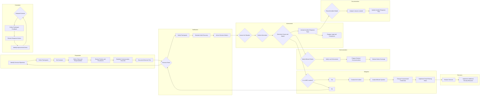

```mermaid
graph LR

subgraph Preparation
  A[Identify Exercise Objectives]
  B[Select Participants]
  C[Set Scenario]
  D[Define Roles and Responsibilities]
  E[Review Policies and Procedures]
  F[Establish Communication Channels]
  G[Document Exercise Plan]
end

subgraph Notification
  H{Exercise Starts}
  I[Notify Participants]
  J[Simulate Initial Discovery]
  K[Inform Decision Makers]
end

subgraph Assessment
  L{Assess the Situation}
  M{Gather Information}
  N{Determine Scope and Impact}
  O[Activate Incident Response Team]
  P[Engage Legal and Compliance]
end

subgraph Mitigation
  Q{Is it a BEC incident?}
  R[Yes]
  S[No]
  T[Contain the Incident]
  U[Isolate Affected Systems]
  V[Change Compromised Credentials]
  W[Implement Email Filtering Rules]
end

subgraph Recovery
  X[Restore Services]
  Y[Implement Additional Security Measures]
end

subgraph Communication
  Z{Notify Affected Parties}
  AA[Notify Law Enforcement]
  AB[Prepare External Communications]
  AC[Monitor Media Coverage]
end

subgraph Documentation
  AD{Record Incident Details}
  AE[Analyze Lessons Learned]
  AF[Update Incident Response Plan]
end

subgraph Evaluation
  AG{Evaluate Exercise}
  AH[Collect Participant Feedback]
  AI[Review Response Actions]
  AJ[Identify Improvement Areas]
end

H --> A
A --> B
B --> C
C --> D
D --> E
E --> F
F --> G

G --> H
H --> I
I --> J
J --> K

K --> L
L --> M
M --> N
N --> O
O --> P

N --> Q
Q --> R
Q --> S
R --> T
S --> H

T --> U
U --> V
V --> W

W --> X
X --> Y

N --> Z
Z --> AA
AA --> AB
AB --> AC

O --> AD
AD --> AE
AE --> AF

AG --> AH
AH --> AI
AI --> AJ
AJ --> AG
```
