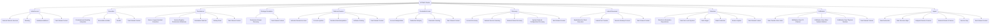

```mermaid
graph TD

A(ATT&CK Tactics) --> B(Initial Access)
A --> C(Execution)
A --> D(Persistence)
A --> E(Privilege Escalation)
A --> F(Defense Evasion)
A --> G(Credential Access)
A --> H(Discovery)
A --> I(Lateral Movement)
A --> J(Collection)
A --> K(Exfiltration)
A --> L(Impact)

B --> B1(External Remote Services)
B --> B2(Phishing)
B --> B3(Hardware Additions)
B --> B4(Taint Shared Content)

C --> C1(Command and Scripting Interpreter)
C --> C2(Executable Installer)
C --> C3(Rootkit)
C --> C4(Taint Shared Content)

D --> D1(Boot or Logon Autostart Execution)
D --> D2(Service Registry Permissions Weakness)
D --> D3(Scheduled Task/Job)
D --> D4(Startup Items)
D --> D5(Taint Shared Content)

E --> E1(Permission Groups Discovery)
E --> E2(Taint Shared Content)

F --> F1(Indicator Removal on Host)
F --> F2(Process Injection)
F --> F3(Runtime Data Manipulation)
F --> F4(Software Packing)
F --> F5(Taint Shared Content)

G --> G1(Account Manipulation)
G --> G2(Credential Dumping)
G --> G3(Password Cracking)
G --> G4(Taint Shared Content)

H --> H1(Account Discovery)
H --> H2(Network Service Scanning)
H --> H3(Network Share Discovery)
H --> H4(System Network Configuration Discovery)
H --> H5(Taint Shared Content)

I --> I1(Exploitation for Client Execution)
I --> I2(Lateral Tool Transfer)
I --> I3(Remote Desktop Protocol)
I --> I4(Taint Shared Content)

J --> J1(Data from Information Repositories)
J --> J2(Data from Local System)
J --> J3(Data Staged)
J --> J4(Email Collection)
J --> J5(Screen Capture)
J --> J6(Taint Shared Content)

K --> K1(Data Transfer Size Limits)
K --> K2(Exfiltration Over C2 Channel)
K --> K3(Exfiltration Over Other Network Medium)
K --> K4(Exfiltration Over Physical Medium)
K --> K5(Taint Shared Content)

L --> L1(Data Destruction)
L --> L2(Disk Structure Wipe)
L --> L3(Endpoint Denial of Service)
L --> L4(Network Denial of Service)
L --> L5(Service Stop)
L --> L6(Taint Shared Content)
```