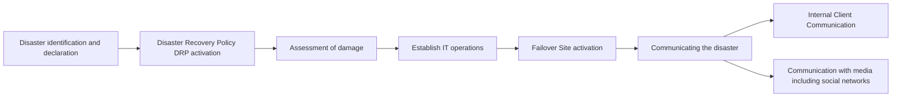
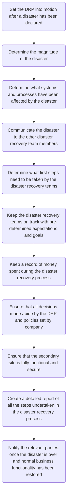

# Key Steps of Disaster Recovery Process

Regardless of the severity of the disaster, dealing with a disaster can be broken down into the following steps:

1. Disaster identification and declaration
2. Disaster Recovery Policy (DRP) activation
3. Assessment of damage
4. Establish IT operations
5. Failover Site activation
6. Communicating the disaster

   a. **Internal Client Communication:** 

   b. **Communication with the media including social networks:** 
____

___

