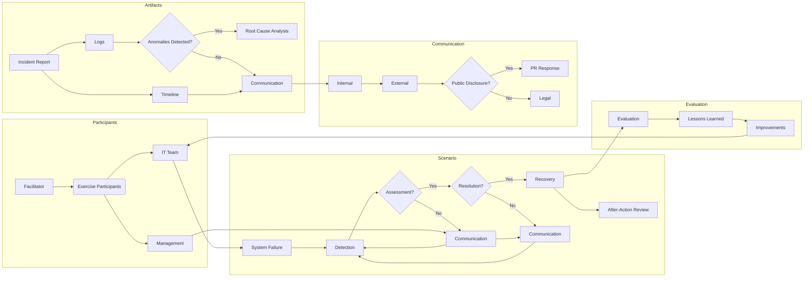

```mermaid
graph LR
    subgraph Participants
    A[Facilitator] --> B(Exercise Participants)
    B --> C[IT Team]
    B --> D[Management]
    end

    subgraph Scenario
    E[System Failure]
    E --> F[Detection]
    F --> G{Assessment?}
    G --> |Yes| H{Resolution?}
    G --> |No| I[Communication]
    I --> F
    H --> |Yes| J[Recovery]
    H --> |No| K[Communication]
    K --> F
    J --> L[After-Action Review]
    end

    subgraph Artifacts
    M[Incident Report]
    M --> N[Timeline]
    M --> O[Logs]
    O --> P{Anomalies Detected?}
    P --> |Yes| Q[Root Cause Analysis]
    P --> |No| R[Communication]
    end

    subgraph Communication
    S[Internal]
    S --> T[External]
    T --> U{Public Disclosure?}
    U --> |Yes| V[PR Response]
    U --> |No| W[Legal]
    end

    subgraph Evaluation
    X[Evaluation]
    X --> Y[Lessons Learned]
    Y --> Z[Improvements]
    end

    C --> E
    D --> I
    I --> K
    J --> X
    N --> R
    R --> S
    Z --> C
```