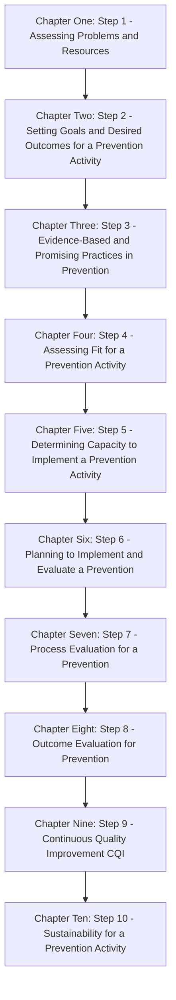

# PDQ Framework Steps

The PDQ framework consists of ten steps that guide the planning and evaluation of prevention activities. These steps are divided into two phases: **Planning** and **Evaluation/Improvement**.

## Planning Phase (Steps 1-6)

### Step 1: Assessing Problems and Resources
- Identify and select priority problems for your prevention activity.
- Understand the available resources.

### Step 2: Setting Goals and Desired Outcomes
- Define a vision, goals, and specific outcomes for your prevention activity.

### Step 3: Evidence-Based and Promising Practices
- Select prevention activities with evidence of effectiveness.

### Step 4: Assessing Fit for a Prevention Activity
- Evaluate how well selected activities fit the target population, community, and mission.

### Step 5: Determining Capacity
- Assess readiness and capacity to implement chosen activities.

### Step 6: Planning to Implement and Evaluate
- Develop detailed work and evaluation plans for prevention activities.

## Evaluation/Improvement Phase (Steps 7-10)

### Step 7: Process Evaluation
- Collect and analyze data on the execution of prevention activities.

### Step 8: Outcome Evaluation
- Measure the impact of prevention activities on desired outcomes.

### Step 9: Continuous Quality Improvement (CQI)
- Review data and past decisions to enhance prevention activities.

### Step 10: Sustainability for a Prevention Activity
- Plan for the long-term sustainability of successful prevention activities.

Follow these steps to effectively plan, implement, evaluate, and improve your prevention initiatives.

---

# PDQ
The first six steps of PDQ focus on prevention activity planning:
- First, use Step 1 to help identify and select the priority problems that your implementation team will address.
- Next, set a vision, goals, and specific desired outcomes that you intend to reach by addressing the priority problem you have selected (PDQ Step 2).
- The guide then helps teams to select candidate prevention activities with evidence of effectiveness that can be used to address the priority problem and meet the specific desired outcomes (PDQ Step 3).
- Next, assess the fit of the candidate prevention activities with the target population(s), community, and mission of the site and how you might adapt them to improve fit (PDQ Step 4).
- Before selecting one or more specific prevention activities, use the PDQ tools to address questions of readiness and capacity to carry out each of the candidate prevention activities you are considering (PDQ Step 5).
- After completing these steps, you should have one or two specific prevention activities that you intend to implement that address the priority problem(s). You can use the work plan and evaluation plan tools to lay out the details for the implementation and evaluation of each activity. It is important to complete Steps 1–6, including evaluation planning (PDQ Step 6), before prevention activity implementation begins.
Once a solid plan is in place, then implementation can start, which initiates the remaining PDQ steps (7–10):
- As the prevention activity is running, collect and analyze data about how well it is running, including participant exposure, adherence to curriculum, and participant satisfaction (PDQ Step 7).
- In PDQ Step 8, track the impact of the activity on your specific desired outcomes for the participants.
- In PDQ Step 9, review all evaluation data and past decisions to improve the activity going forward.
- If the activity is successful, make a plan to sustain it so that it can continue to have positive impacts on your specific desired outcomes (PDQ Step 10).
